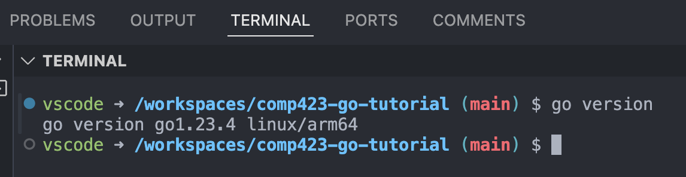
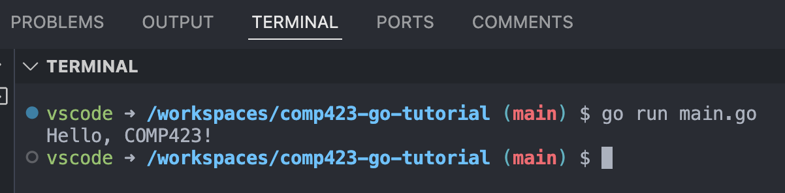

# Setting up a dev container for Go and printing to output

* Primary author: [Colby Eagan](https://github.com/colbyeagan)
* Reviewer: [Lily Moore](https://github.com/lilyem)


### Prerequisites
* [Git](https://git-scm.com/downloads) and a [GitHub Account.](https://www.google.com/url?sa=t&source=web&rct=j&opi=89978449&url=https://github.com/&ved=2ahUKEwiG29OU45OLAxVKw_ACHaGgCdAQFnoECAoQAQ&usg=AOvVaw38IHvcyBra8HGhmSxvlCGw)
* Visual studio code: Download and install it from [here.](https://code.visualstudio.com/download)
* Install Docker [here.](https://docs.docker.com/desktop/setup/install/mac-install/)

### Creating your local and remote repository  
* Inspiration taken from COMP423 [Starting a Static Website tutorial.](https://comp423-25s.github.io/resources/MkDocs/tutorial/)

#### (A) Make a directory to setup your repository


(1) Open the terminal on your computer 

(2) Create a new directory for your project by using the cd command to switch into your directory of choice then creating the project dir. 

``` py
mkdir comp423-go-tutorial
cd comp423-go-tutorial
```

(3) Initialize a new Git repo:

``` py
git init
```

(4) Create a README.md file
```
echo "# Tutorial for setting up a go devcontainer and programming in go" > README.md
git add README.md
git commit -m "Initial commit with README"
```

#### (B) Create a remote repo on github
(1) Log into GitHub and go to the [Create a New Repository](https://github.com/new) tab.

(2) Name your repository `comp423-go-tutorial` and add a description. Make your repository public.

(3) Do not initialize with a README.

(4) Click on "Create Repository".


#### (C) Conect your Local and Remote Repo

(1) Add GitHub repo as remote

```
git remote add origin https://github.com/<your-username>/comp423-go-tutorial.git
```

!!! warning 

    Replace the parts of the link between <> with your username!

(2) Push your local commits to the remote repository 

```
git push --set-upstream origin main
```
!!! note 

    If there are issues with your repo, use git status and git log to debug. Ensure that your main branch is named main on origin


### Setting up the Development Environment  
* Inspiration taken from COMP423 [Starting a Static Website tutorial.](https://comp423-25s.github.io/resources/MkDocs/tutorial/)

(1) Open your repository directory in VS Code. 

(2) Install "Dev Containers" extension for VS Code.

(3) Create a `.devcontainer` directory in the root of your project folder and add the file 
    `
    .devcontainer/devcontainer.json
    `

(4) Add the proper contents to the `devcontainer.json` file
``` json
{
    "name": "COMP423 Go Tutorial - Go Development",
    "image": "mcr.microsoft.com/devcontainers/go:latest", 
    "customizations": {
      "vscode": {
        "settings": {},
        "extensions": [
          "golang.go" 
        ]
      }
    },
    "postCreateCommand": "go mod init comp423 && go install"
  }
```

`name` describes the name for your dev container

`image` specifies what kind of programming environment to setup for your dev container

`customizations` configures VS Code by installing certain language support extensions

`postCreateCommand` runs commands after creating the container to install necesarry parts of the dev environment. In this case we wish to add a go mod file to the directory and install go.

(5) Reopen your project in your devcontainer by pressing `f1` and typing (and selecting) "Dev Containers: Reopen in Container".

(6) Run go version. Your terminal should show something like this:


{ align=left }    

    

!!! note 

    You may have a different version of go. This tutorial installs the latest version which may change overtime.


### Printing "Hello COMP423"

Now it is time to create a go file, add the contents for our first go program, and then run it!

(1) Begin by creating a `main.go` file in your main directory (comp423-go-tutorial) 

(2) In the `main.go` file, add the contents

``` go
package main

import "fmt"

func main() {
	fmt.Println("Hello, COMP423!")
}
```  
      

(3) Save this file and then in your terminal run
``` 
go run main.go
```   

Your console should look like this!  
{ align=left }  
!!! note 

    The "go run" command compiles and runs in one step!

### Push your changes to the remote repository  

(1) Save all files and add your changes
``` py
git add .
```

(2) Commit with a meaningful message:

``` py
git commit -m "Setup dev container and wrote first go program"
```

(3) Push your changes to the remote repo
```
git push origin main
```

(4) Go to github and check your remote repo to ensure changes have pushed
If changes havent pushed, make sure that your remote url is accurate.


### Conclusion  
This is all for now! You have just created a git repo, hosted it on github, made a dev container, configrued it for go, and ran a go program within the container!